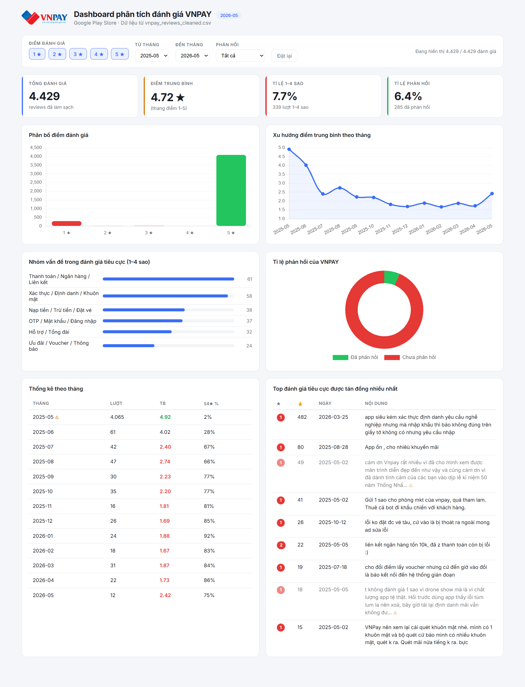

# VNPAY Crawl & Analysis

Dự án thu thập và phân tích đánh giá ứng dụng VNPAY trên Google Play, phục vụ mục tiêu theo dõi chất lượng sản phẩm, xu hướng trải nghiệm người dùng và các nhóm vấn đề nổi bật theo thời gian.

## 1. Mục tiêu dự án

- Thu thập dữ liệu đánh giá từ Google Play Store.
- Làm sạch dữ liệu, đánh giá chất lượng dữ liệu và tạo báo cáo phân tích.
- Trực quan hóa kết quả bằng dashboard để theo dõi nhanh các chỉ số chính.

## 2. Nội dung chính trong repo

- [crawl_vnpay_reviews.py](crawl_vnpay_reviews.py): Script crawl dữ liệu review từ Google Play.
- [analyze_reviews.py](analyze_reviews.py): Pipeline làm sạch dữ liệu, profiling và phân tích.
- [analysis_report.md](analysis_report.md): Báo cáo phân tích tổng hợp.
- [vnpay_dashboard.html](vnpay_dashboard.html): Dashboard trực quan KPI và xu hướng.
- [dashboard.png](dashboard.png): Ảnh chụp dashboard để xem nhanh trên GitHub.
- [Insights trọng tâm.docx](Insights%20tr%E1%BB%8Dng%20t%C3%A2m.docx): Tài liệu insight tổng hợp cho stakeholder.
- [vnpay_reviews_cleaned.csv](vnpay_reviews_cleaned.csv): Dữ liệu đã làm sạch để tái hiện báo cáo/dashboard.
- [extracted_samples.json](extracted_samples.json): Mẫu review trích xuất phục vụ tham khảo nhanh.
- [VNPAY_logo.png](VNPAY_logo.png): Ảnh logo dùng trong dashboard.

## 3. Xem nhanh trên GitHub

- Tài liệu insight: [Insights trọng tâm.docx](Insights%20tr%E1%BB%8Dng%20t%C3%A2m.docx)

Ảnh dashboard tổng quan:



## 4. Tệp giữ local (không push)

Các tệp dưới đây được giữ local qua [.gitignore](.gitignore):

- `.venv/`, `*.log`, `cleaning_log.jsonl`
- `vnpay_reviews_gstore_*.csv` (dữ liệu raw)
- `_csv_gz_b64.txt`, `_logo_b64.txt` (artefact trung gian)

## 5. Yêu cầu môi trường

- Python 3.10 trở lên.
- Thư viện cần thiết:

```bash
pip install pandas numpy
```

## 6. Cách chạy

1. Crawl dữ liệu mới:

```bash
python crawl_vnpay_reviews.py
```

2. Phân tích và sinh báo cáo:

```bash
python analyze_reviews.py --input vnpay_reviews_gstore_YYYYMMDD_HHMMSS.csv
```

Nếu bỏ qua `--input`, script sẽ tự chọn file raw mới nhất theo mẫu `vnpay_reviews_gstore_*.csv`.

3. Mở dashboard:

Mở [vnpay_dashboard.html](vnpay_dashboard.html) trên trình duyệt.

## 7. Đầu ra sau phân tích

- [vnpay_reviews_cleaned.csv](vnpay_reviews_cleaned.csv): Dữ liệu sạch.
- [analysis_report.md](analysis_report.md): Báo cáo markdown.
- `cleaning_log.jsonl`: Log làm sạch (giữ local).

## 8. Lưu ý khi nộp

- Repo đã tách dữ liệu raw và artefact không cần thiết để tránh tăng dung lượng.
- Có sẵn tài liệu insight và ảnh dashboard để người xem nắm nhanh nội dung mà không cần chạy code.
- Có thể tái lập quy trình bằng 2 script chính: crawl và analyze.
